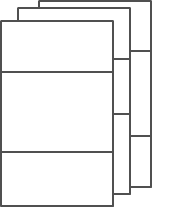
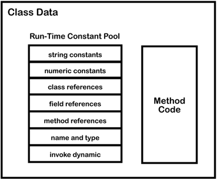

### Java字节码系列一

+ [原文链接]([https://wl9739.github.io/2018/07/17/%E5%A6%82%E4%BD%95%E9%98%85%E8%AF%BB-Java-%E5%AD%97%E8%8A%82%E7%A0%81/](https://wl9739.github.io/2018/07/17/如何阅读-Java-字节码/))

> JVM数据类型

- 基本数据类型
  - 数字类型:`byte`(8位),`short`(16位),`int`(32位),`long`(64位),`char`(16位无符号Unicode),`float`(32位IEEE754单精度), `double`(64位IEEE754双精度)
  - `boolean` 类型
  - `ReturnAddress` 指令指针
- 引用类型
  - 类类型
  - 集合类型
  - 接口类型

`boolean`类型在字节码里面支持有限,并没有一个指令可以直接操作`boolean`类型的值,布尔值一般会被编译器专为`int`类型的值,并且用`int`类型的相关指令来操作

> 栈基架构

- **PC寄存器**:程序计数器,Java程序里的每一个运行的线程,都有一个PC寄存器存储着当前指令的地址

- **JVM栈**:对于每一个线程,`栈`是用来存放局部变量、方法参数以及返回值的。以下这张图表示三个线程的栈信息:

  

- **堆**:所有线程共享的内存区域,存放着对象(类的实例化和数组).对象有垃圾回收器进行再分配 。

- **方法区**:对于每一个加载的类,方法区里存放着加载的类的信息(包括类的名称、方法信息、字段信息)、静态变量、常量以及编译器编译后的代码等。

  

栈是由一系列的`桢`(frame)组成,当调用一个方法的时候,会将一`桢`的内存入栈,当方法运行结束(正常结束或异常抛出)的时候,就会将栈顶的`桢`给弹出。

桢的组成:

- 一个*局部变量数组*,索引序列从0开始,数组长度由编译器计算,除了`long`和`double`类型的值需要两个局部变量的空间来存储,其他任何类型都可以存储在一个局部变量里。
- 一个用来存储中间变量的操作栈。该中间变量的作用是充当指令的操作数,或者存放方法调用的参数。

