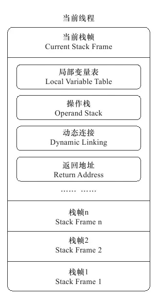

### Java字节码系列二

[原文链接](https://juejin.im/post/6844903655796113421)

#### 概述

​		`栈桢`(Stack Frame)是用于支持虚拟机进行方法调用和方法的数据结构,它是虚拟机运行时数据区的的虚拟机栈((Virtual Machine Stack)的栈元素。栈桢存储了方法的`局部变量表`,`操作数栈`,`动态链接`和`方法返回地址`等信息。第一个方法从调用开始到执行完成,对应着一个栈桢在虚拟机栈中从入栈道出栈的过程。

​		在编译代码的时候,栈桢中需要多大的`局部变量表`,多深的`操作数栈`都已经**完全确定**了,并且写入了方法表中的Code属性中,**因此一个栈桢需要分配多少内存,不会受到程序运行期间变量数据的影响,只取决于不同的虚拟机实现方式**。

示例为falseFlag方法的编译后的字节码指令,可以看到Code的属性`stack=2`表示的是falseFlag方法的`操作数栈`深度为2,`locals=1`表示`局部变量表`的大小为1。

```java

private boolean  falseFlag= false;
public void falseFlag(){
  if(falseFlag){
    System.out.println("debug log...");
  }
}

// 编译后的字节码指令
public void falseFlag();
    descriptor: ()V
    flags: ACC_PUBLIC
    Code:
      stack=2, locals=1, args_size=1
         0: aload_0
         1: getfield      #4                  // Field falseFlag:Z
         4: ifeq          15
         7: getstatic     #5                  // Field java/lang/System.out:Ljava/io/PrintStream;
        10: ldc           #6                  // String debug log...
        12: invokevirtual #7                  // Method java/io/PrintStream.println:(Ljava/lang/String;)V
        15: return
      LineNumberTable:
        line 22: 0
        line 23: 7
        line 25: 15
      StackMapTable: number_of_entries = 1
        frame_type = 15 /* same */
```

​		一个线程中的方法调用链可能会很长,对于执行引擎而言,活动线程中,只有**虚拟机栈顶的栈桢才是有效的**,称为`当前栈桢`(Current Stack Frame),这个栈桢关联的方法称为`当前方法`(Current Method)。




> 局部变量表

​		`局部变量表`(Local Variable Table)是一组**变量值存储空间**,**用于存放方法参数和方法内部定义的局部变量**。在编译Class文件时,在方法的Code属性中的`locals`数据项已经确定了该方法的局部变量表需要分配的容量。

​		**局部变量表**的容量是以`变量槽`(Variable Slot)为最小单位,虚拟机规范中并没有明确指明一个`Slot`应占用的内存空间大小,只是建议每个Slot都应该能存放一个`boolean`、`byte`、`char`、`short`、`int`、`float`、`reference`或`returnAddress`类型的数据,对于64位的`long`和`double`类型的变量,虚拟机会为其**分配两个连续的Slot空间**。

​		为了节省栈桢空间,局部变量表中的Slot是可以复用的。当离开了某些变量的作用域之后,这些变量对应的Slot就可以交给其他变量使用。这种机制有时候会影响垃圾会影响垃圾回收行为。

- Solt复用验证

  - GC方式

  ```java
  		public static void main(String[] args) {
          byte[] placeholder = new byte[64 * 1024 * 1024];
          int i = 0;
          System.gc();
      }
  		
  ```

  ```verilog
  [GC (System.gc()) [PSYoungGen: 2001K->528K(38400K)] 67537K->66072K(125952K), 0.0010556 secs] [Times: user=0.00 sys=0.00, real=0.00 secs] 
  [Full GC (System.gc()) [PSYoungGen: 528K->0K(38400K)] [ParOldGen: 65544K->65963K(87552K)] 66072K->65963K(125952K), [Metaspace: 3083K->3083K(1056768K)], 0.0067655 secs] [Times: user=0.01 sys=0.00, real=0.00 secs]
  ```

  ```java
  		public static void main(String[] args) {
          {
              byte[] placeholder = new byte[64 * 1024 * 1024];
          }
          int i = 0;
          System.gc();
      }
  ```

  ```verilog
  [GC (System.gc()) [PSYoungGen: 2666K->528K(38400K)] 68202K->66072K(125952K), 0.0018456 secs] [Times: user=0.00 sys=0.00, real=0.01 secs] 
  [Full GC (System.gc()) [PSYoungGen: 528K->0K(38400K)] [ParOldGen: 65544K->427K(87552K)] 66072K->427K(125952K), [Metaspace: 3088K->3088K(1056768K)], 0.0053778 secs] [Times: user=0.01 sys=0.00, real=0.00 secs]
  ```

  可以看到当把Byte的声明方式单独放入代码块种,然后再执行作用域之外的代码的时候,GC对Slot进行了回收

  - 字节码方式

  ```java
  		public static void main(String[] args) {
          byte[] placeholder = new byte[64 * 1024 * 1024];
          int i = 0;
          System.gc();
      }
  ```

  ```java
  	public static void main(java.lang.String[]);
      descriptor: ([Ljava/lang/String;)V
      flags: ACC_PUBLIC, ACC_STATIC
      Code:
        stack=1, locals=3, args_size=1
           0: ldc           #2                  // int 67108864
           2: newarray       byte
           4: astore_1
           5: iconst_0
           6: istore_2
           7: invokestatic  #3                  // Method java/lang/System.gc:()V
          10: return
        LineNumberTable:
          line 6: 0
          line 7: 5
          line 8: 7
          line 9: 10
  ```

  ```java
  		public static void main(String[] args) {
          {
              byte[] placeholder = new byte[64 * 1024 * 1024];
          }
          int i = 0;
          System.gc();
      }
  ```

  ```java
  	public static void main(java.lang.String[]);
      descriptor: ([Ljava/lang/String;)V
      flags: ACC_PUBLIC, ACC_STATIC
      Code:
        stack=1, locals=2, args_size=1
           0: ldc           #2                  // int 67108864
           2: newarray       byte
           4: astore_1
           5: iconst_0
           6: istore_1
           7: invokestatic  #3                  // Method java/lang/System.gc:()V
          10: return
        LineNumberTable:
          line 13: 0
          line 15: 5
          line 16: 7
          line 17: 10
  ```

  以上示例代码中的Code中的属性`locals`值的不同和字节码指令的第4行和第6行`store`的指令可以看到Slot被复用。

  提示:`astore_1`表示将栈顶ref对象存入局部变量表中的第二位,`istore_2`表示将栈顶int数值存入局部变量表的第三位。

